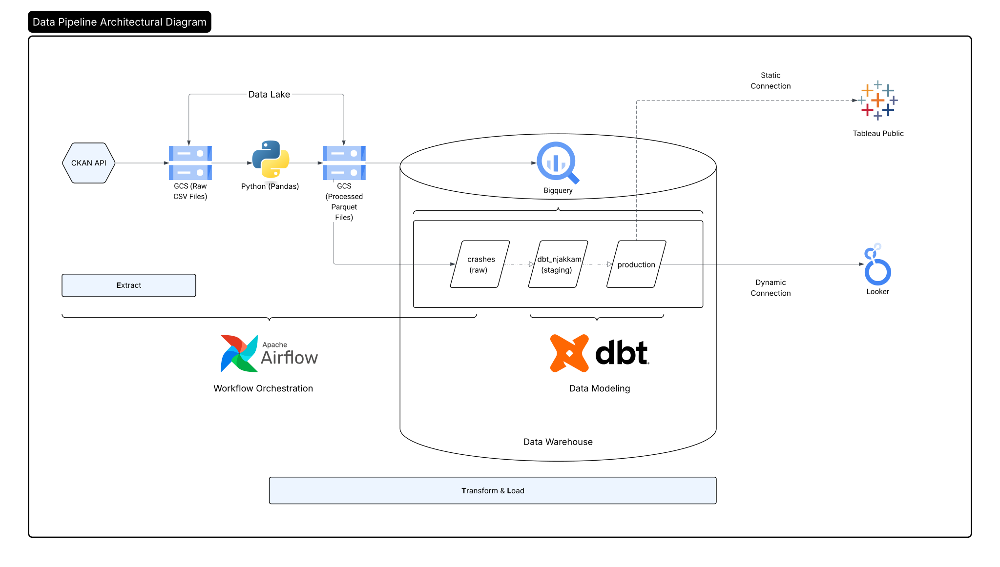

<h1 align="center">💥🚗 California Crash Reporting System (CCRS)   Pipeline & Dashboard </h1>

This project creates an ETL pipeline for exploring motor vehicle crash data from the [California Crash Reporting System (CCRS)](https://data.ca.gov/) taken from the California Open Data Portal. I used this pipeline to build two dashboards to visualize and analyze crash data taken from **2016 to 2024** that you can view below:

- **[Tableau Public Dashboard](https://public.tableau.com/app/profile/nikita.jakkam/viz/CCRSDashboard/OverviewDashboard)** — A **static** Tableau Public dashboard that visualizes crash trends from 2016–2024. I built this version to have more polished and customized dashboard design.
- **[Looker Studio Dashboard](https://lookerstudio.google.com/s/houpEX8slXw)** — A **non-static dashboard** connected directly to **BigQuery**, using the data pipeline built for this project.

## Pipeline Overview & Architecture

## Acknowledgements
